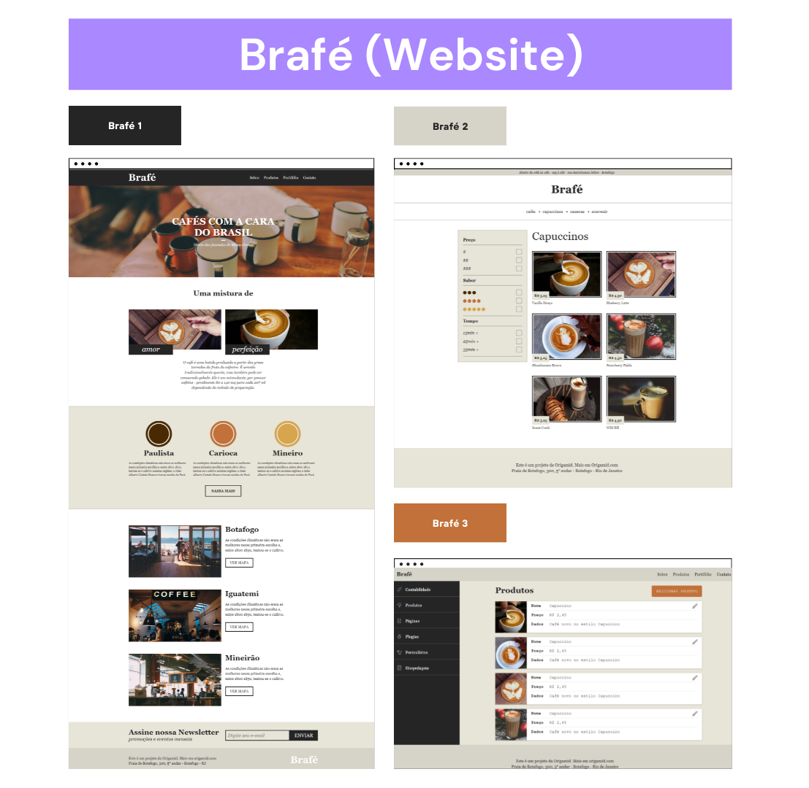

# Brafé ☕

O site Brafé foi desenvolvido durante o curso CSS Avançado Posicionamento, da Origamid.
No curso aprendemos os fundamentos para posicionar os elementos em uma página e como cada propriedade age no layout do site.

Durante o curso criei três projetos, cada projeto foi codificado de quatro maneiras diferentes.
A primeira forma foi pura, a segunda forma foi utilizando o sistema de Grid, a terceira foi com o Flexbox, e a quarta com Bootstrap.

## 🛠️ Tecnologias

- CSS
- HTML
- Bootstrap

## 💙 Contato

joaoliveira.batista1@gmail.com
